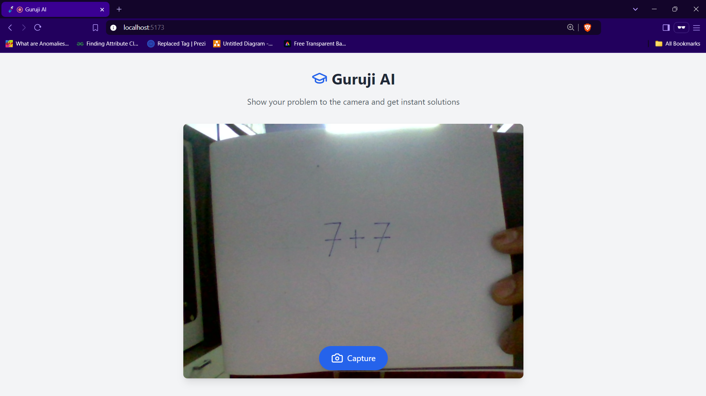
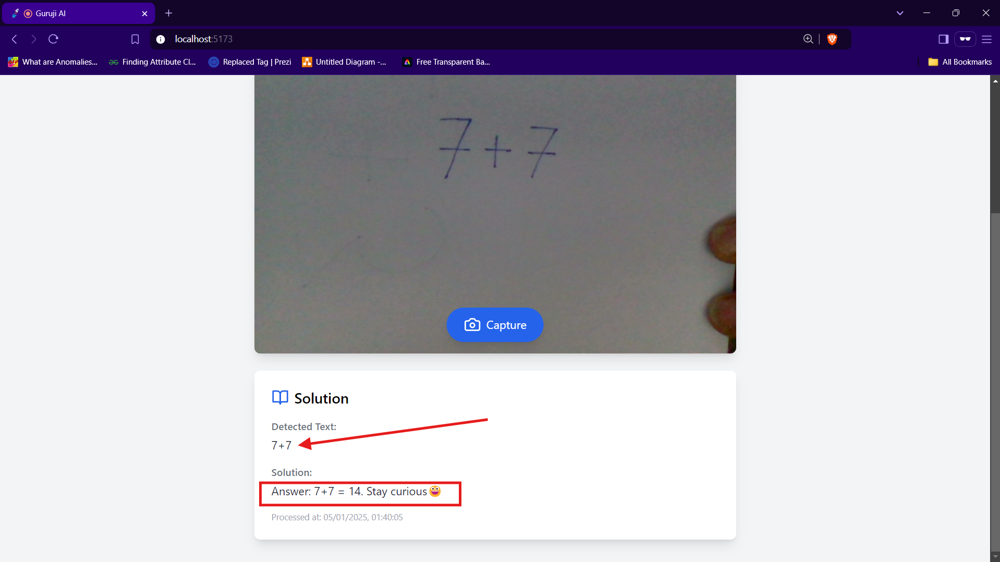
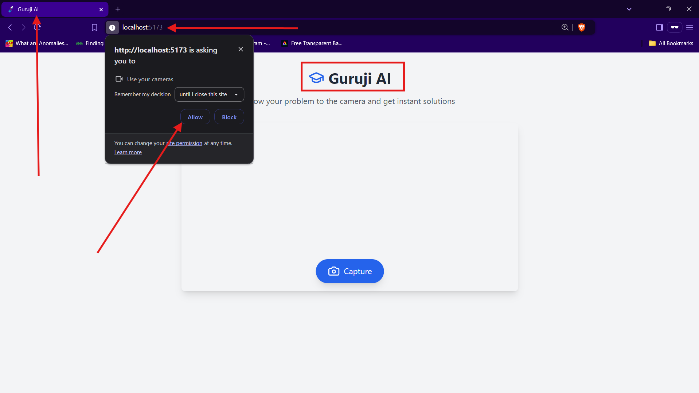

# Guruji AI 🌟📚🤖  

A **minimal yet fully-featured AI-powered live teaching app** built to transform how problems are captured, processed, and solved in real-time! Designed with cutting-edge technologies, a clean UI, and a focus on cost optimization, this project is an ideal companion for students, educators, and tech enthusiasts.  

---  

## 🔍 Preview  




---

## 🚀 Features  

- **📷 Live Camera Feed**: Automatically selects the environment-facing camera for better visibility.  
- **🖼️ Image Capture**: Simple, intuitive button for image capture.  
- **🔍 OCR Processing**: Powered by Tesseract.js for local text recognition.  
- **🧠 AI-Powered Solutions**: Generates solutions using `gpt-4o-realtime-preview`.  
- **🎨 Clean UI**: Responsive design with helpful loading states.  
- **⚡ Error Handling**: Robust error detection and user notifications at every step.  

---

## 💡 Cost Optimization  

- **Local OCR**: Processes images locally with Tesseract.js, saving on API calls for text recognition.  
- **Efficient OpenAI Usage**: API calls are made only after successful OCR extraction.  
- **Token Control**: Responses limited to 500 tokens to keep API costs low.  
- **Smart Caching**: Caches responses in the UI to prevent redundant API calls.  

---

## 📚 Usage  

1. **Grant Camera Permissions**: Allow the app to access your device's camera.  
2. **Point and Capture**: Aim at the problem (ensure the text is clear and well-lit) and click the capture button.  
3. **Processing Magic**: The app processes the image (OCR → AI) and generates the solution.  
4. **View Results**: The solution appears below the camera feed. 🎉  




---

## 🛠️ Tech Stack  

- **Frontend**: Next.js, Vite, HTML, CSS, TypeScript, TailwindCSS  
- **AI Integration**: OpenAI GPT-4 API  
- **OCR Processing**: Tesseract.js (Future upgrade possible with Mathpix)  

---

## 🔧 Setup Instructions  

Follow these steps to get the project running locally:  

1. **Clone the Repository**:  
   ```bash  
   git clone https://github.com/Abhiz2411/guruji-ai
   cd guruji-ai  
   ```  

2. **Install Dependencies**:  
   ```bash  
   npm install  
   ```  

3. **Set Up Environment Variables**:  
   - Create a `.env` file in the root directory.  
   - Add your OpenAI API key:  
     ```env  
     OPENAI_API_KEY=your_openai_api_key_here  
     ```  

4. **Run the Development Server**:  
   ```bash  
   npm run dev  
   ```  

5. **Open in Browser**:  
   Navigate to `http://localhost:3000` to use the app.  

---

## 🤔 Why This Project?  

I am a student with a passion for building innovative solutions. This project was created for a competition under budget constraints, but it has immense potential for **commercial use** with the following upgrades:  

- Integration with **Mathpix** for enhanced OCR and formula recognition.  
- Support for **multiple languages** for global accessibility.  
- Advanced **customizable UI** for branding and personalization.  
- Incorporation of **offline capabilities** for remote areas.  

If you like this project and wish to contribute or upgrade it, feel free to reach out!  

---

## 🏆 My Goal  

This project showcases what can be achieved with dedication, even under constraints. I hope to inspire others to innovate and explore the potential of AI in education.  

---

## 📩 Contact  

Feel free to connect if you have ideas, suggestions, or feedback!  

- **Email**: [abhijitzende75@gmail.com](mailto:abhijitzende75@gmail.com)  
- **GitHub**: [GitHub Profile](https://github.com/Abhiz2411)  

---  

⭐ **If you like this project, don't forget to give it a star!** ⭐  
